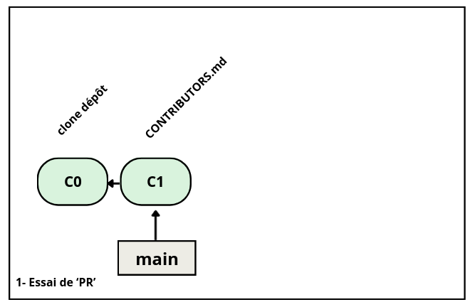
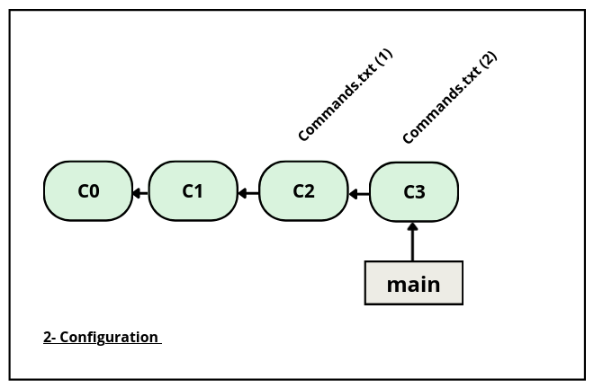
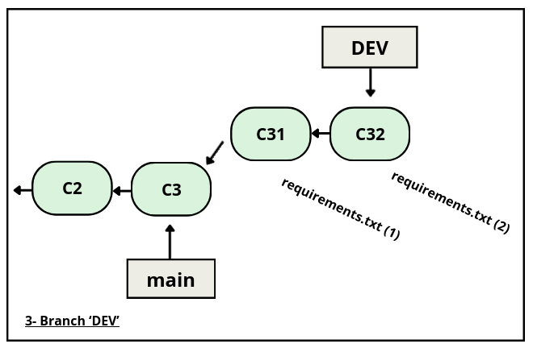
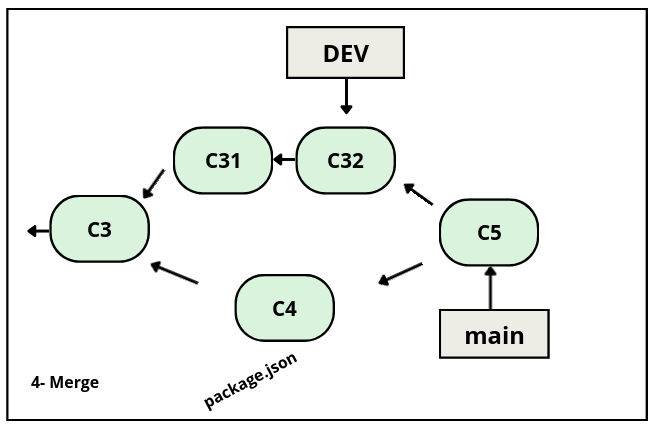
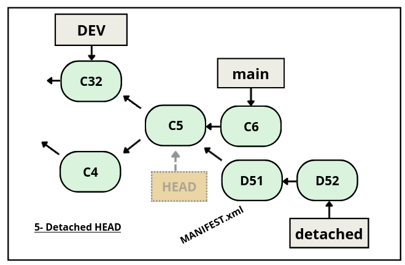

# 20231210_vckd_git_eval
Évaluation git pour les but3 vcod

### Règles du jeu

1. l'épreuve dure 1h15
1. une bonne réponse rapporte 1pt
1. une demande d'aide coûte 1pt
1. vous ferez des messages de commit sous la forme "Cx" où x est un entier, ceci afin de ressembler exactement aux schémas
1. pour chaque commande git que vous exécutez, collez la dans un fichier `Commands.txt` que vous committerez tout à la fin 
1. 10 min avant la fin, vous traiterez la section 6


**Nota 1:**
```
pour économiser de la place, la partie gauche des schémas d'historique a été tronquée.
```

**Nota 2:**
```
pensez à utiliser 'gitk' ou 'git l' afin de visualiser votre travail.
```

**Nota 3:**
```
pensez à consulter les cours en pdf pour vous aider
vous pouvez aussi chercher la syntaxe des commandes sur google
```
[Dépôt des cours GIT](https://github.com/but3-vcod/courses/tree/main/git-workshop)

**Nota 4:**
```
pour faire un merge de la branch POUF avec le message "pif paf", lancez
git merge POUF -m "pif paf"
```

**Nota 5:**
```
pour pousser toutes vos branches sur github
git push --all
```


### Mise en place

1. forkez le dépôt `20231208_vckd_git_eval` dans votre compte github
1. cloner ce nouveau dépôt sur votre espace de travail local (poste windows)
1. vérifiez que vous êtes bien dans la branche 'main' avec comme premier message de commit "C0"


### 1- Essai de 'PR' 
(pensez à coller toute commande git dans le fichier Commands.txt)

1. Insérer votre nom dans le fichier `CONTRIBUTORS.md`
1. commitez avec le message "C1"
1. envoyer sur *votre* dépôt github
1. ouvrir une pull request.




### 2- Configuration
(pensez à coller toute commande git dans le fichier Commands.txt)

1. Dans le fichier `Commands.txt` insérer les commandes git pour créer les alias suivants:
    * 's' alias de 'status -s'
    * 'l' alias de 'log --graph --oneline'
    * 'ci' alias de 'commit'
    * 'br' alias de 'branch'
1. commitez ce fichier  avec le message "C2"
1. Exécutez réellement ces commandes pour votre dépôt local et vérifiez qu'elles fonctionnent (nécessaire pour la suite)
1. dans le fichier `Commands.txt`, insérez les commandes pour la config suivante:
    * ajouter votre nom d'utilisateur 
    * ajouter votre email 
1. commitez à nouveau avec le message "C3"
1. poussez sur github et ouvrez une nouvelle 'PR'




### 3- Branche 'DEV'
(pensez à coller toute commande git dans le fichier Commands.txt)

1. créez une branche nommée 'DEV'
1. créez un fichier `requirements.txt` (sans contenu)
1. commitez le  avec le message "C31"
1. remplir le fichier avec 3 dépendances
1. commitez une nouvelle fois (toujours dans 'DEV') avec le message "C32"
1. poussez sur github et ouvrez une nouvelle 'PR'



### 4- Merge
(pensez à coller toute commande git dans le fichier Commands.txt)

1. sur la branche 'main' créez un nouveau fichier 'package.json' 
1. commitez  le avec le message "C4"
1. mergez la branche 'DEV' dans la branch 'main'  avec le
   message de commit "C5"
1. poussez sur github et ouvrez une nouvelle 'PR'



### 5- Detached HEAD
(pensez à coller toute commande git dans le fichier Commands.txt)

1. rajouter une dépendance dans "requirements.txt"
1. commiter avec le message "C6" sur la branche 'main'
1. positionnez HEAD sur le commit  "C5"
1. rajoutez le fichier MANIFEST.xml avec un contenu de votre choix
1. commiter avec le message "D51"
1. refaire un autre commit avec le message "D52"
1. créer une branche "detached" sur ce commit
1. poussez sur github et ouvrez une dernière 'PR'




### 6- Commiter et pusher le fichier Commands.txt

Finalisez votre travail en pushant le fichier `Commands.txt`

1. git add Commands.txt
1. git ci -m "Dernier commit"
1. git push
1. ouvrir la derniére 'PR'
